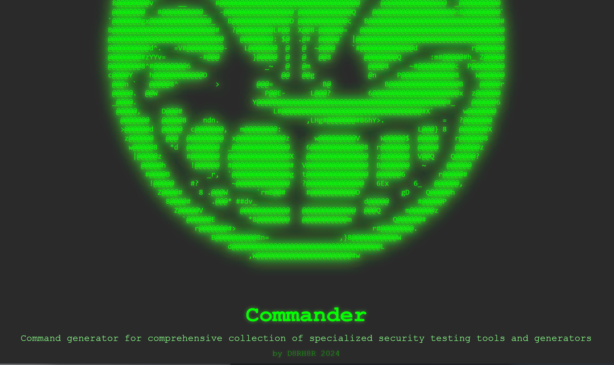
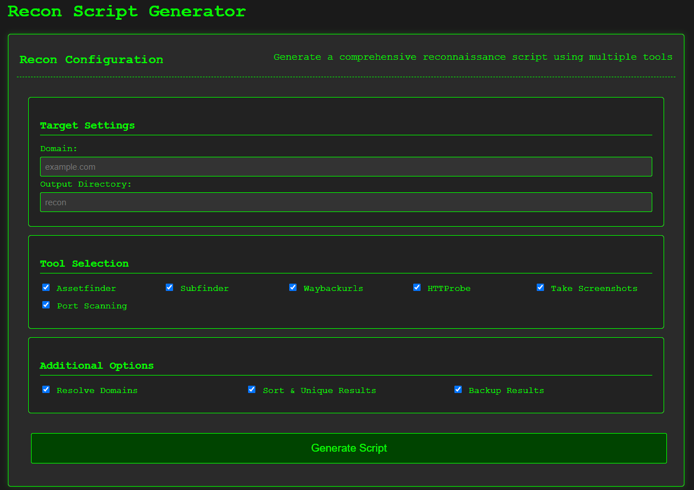
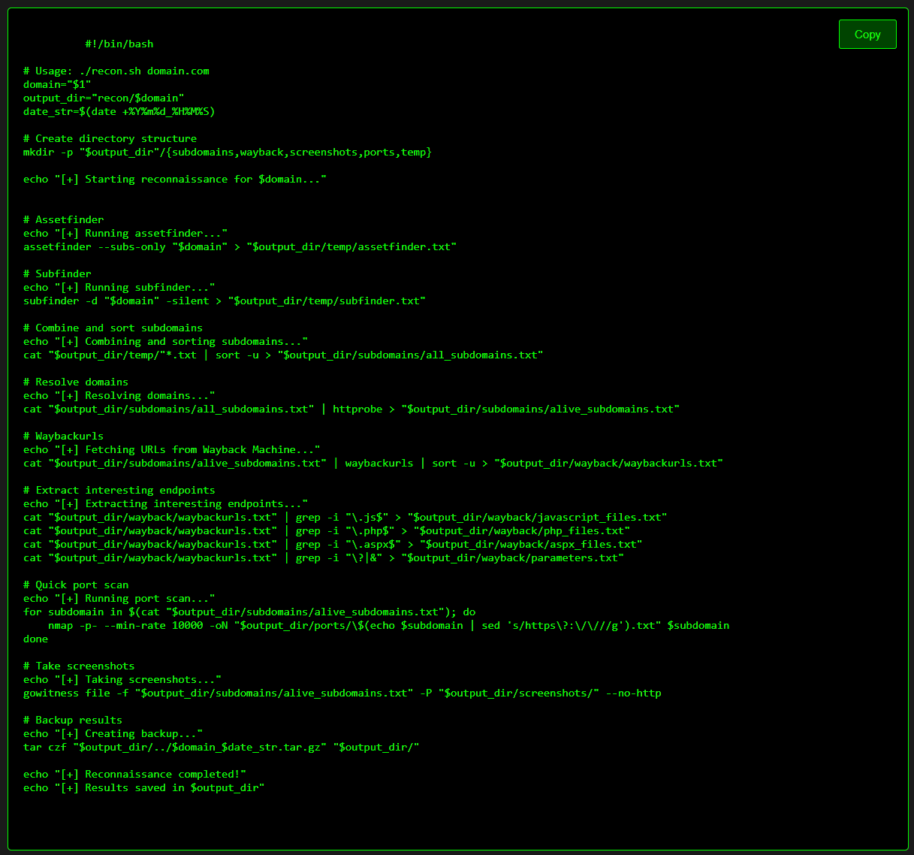

# Commander: Advanced Security Command Generator

 

Commander is an all-in-one security tool designed to simplify and automate the generation of commands for specialised penetration testing tools. It features an intuitive interface with built-in scripts and presets to help security professionals focus on the mission.

## ✨ Features

- **Network Analysis Tools**
  - Generate advanced `nmap` commands for detailed scanning.
  - Configure and launch `Responder` for LLMNR/NBT-NS/mDNS poisoning.
- **Web Application Security**
  - Automate SQL injection testing with `SQLMap`.
  - Scan web servers for vulnerabilities using `Nikto`.
  - Detect XSS with `Dalfox`.
- **Password Cracking**
  - Generate configurations for `John The Ripper` and `Hashcat`.
- **Wireless Tools**
  - Launch `Aircrack-ng` and configure wireless attack workflows.
  - Perform GSM analysis using `GR-GSM` and `Kalibrate`.
- **System Reconnaissance**
  - Automate enumeration for Linux and Windows systems.
  - Generate scripts for `SSH`, `Socat`, and `Kerbrute`.

## 🎯 Why Use Commander?

- Save hours of manual configuration.
- Intuitive UI for both beginners and experts.
- Comprehensive library of tested tools.
- Customisable commands and outputs.

## 📦 Installation

1. Clone the repository:
   ```bash
   git clone https://github.com/scs-labrat/commander.git
   cd commander
   ```

2. Open the `index.html` file in your browser:
   ```bash
   open index.html
   ```

3. Start generating commands!

## 🖼️ Screenshots

 <!-- Replace with a real screenshot -->
 <!-- Replace with a real screenshot -->

## 🧰 Tools Supported

| Network Analysis        `nmap`, `Responder`                                     |
| Web Application         `SQLMap`, `Nikto`, `Dalfox`                             |
| Password Cracking       `John The Ripper`, `Hashcat`                            |
| Wireless Tools          `Aircrack-ng`, `GR-GSM`, `kalibrate`                    |
| System Reconnaissance   `Kerbrute`, `assetfinder`, `waybackurls`, `subfinder`   |

## 🚀 Usage

1. Select the desired tool from the grid.
2. Customise the command parameters.
3. Click "Generate Command."
4. copy the command for execution.


## 📄 License

Commander is licensed under the [MIT License](LICENSE).


## 🌟 Acknowledgements

- ASCII art by [Your Name](https://github.com/scs-labrat).
- Inspired by the open-source community and security innovators.

---

### 🚨 Disclaimer

Commander is intended for ethical and authorised use only. Misuse of this tool is strictly prohibited.

---

💻 **Built with passion by [d8rh8r](https://github.com/scs-labrat).**
